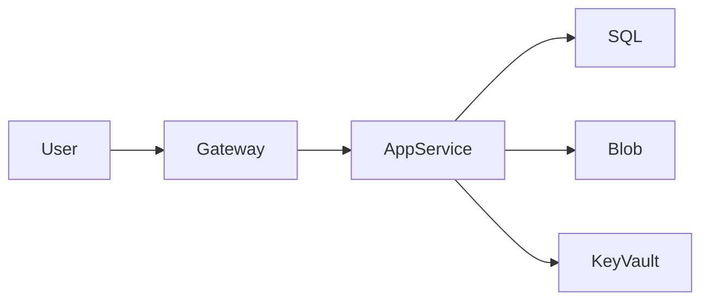

# Arquitetura Azure

## Sumário
- [Descrição da Arquitetura](#descrição-da-arquitetura)
- [Diagrama da Arquitetura](#diagrama-da-arquitetura)
- [Componentes Principais](#componentes-principais)
- [Fluxo de Dados](#fluxo-de-dados)
- [Considerações de Segurança](#considerações-de-segurança)
- [Custos Estimados](#custos-estimados)
- [Referências](#referências)

## Descrição da Arquitetura
Esta arquitetura utiliza os seguintes serviços do Azure:

- Azure App Service para hospedar a aplicação web.
- Azure SQL Database para persistência dos dados.
- Azure Blob Storage para armazenar arquivos.
- Azure Application Gateway para gerenciamento de tráfego.
- Azure Key Vault para segredos e chaves.

## Diagrama da Arquitetura

---

## Componentes Principais

| Componente              | Tipo Azure           | Descrição                                      |
|------------------------|----------------------|------------------------------------------------|
| Web App                | Azure App Service    | Hospeda a aplicação front-end e API.           |
| Banco de Dados         | Azure SQL Database   | Armazena os dados estruturados.                |
| Armazenamento de Blobs | Azure Blob Storage   | Guarda arquivos de mídia e documentos.         |
| Balanceador            | Application Gateway  | Gerencia o tráfego com regras e SSL.           |
| Cofre de Segredos      | Azure Key Vault      | Protege segredos e credenciais da aplicação.   |

## Fluxo de Dados

1. O usuário acessa o site pelo navegador.
2. O tráfego é roteado pelo Application Gateway.
3. O Gateway direciona para o App Service (Web App).
4. A aplicação consulta dados no Azure SQL Database.
5. Arquivos enviados são armazenados no Blob Storage.
6. Senhas e chaves são acessadas via Azure Key Vault.

## Considerações de Segurança

- HTTPS habilitado em todos os serviços.
- Azure Key Vault usado para armazenar segredos.
- RBAC (controle de acesso baseado em funções) aplicado.
- Monitoramento via Azure Monitor e Application Insights.

## Custos Estimados

| Serviço                | Nível                | Estimativa Mensal |
|------------------------|----------------------|--------------------|
| App Service           | B1 (Basic)           | R$ 85              |
| SQL Database          | S1 Standard          | R$ 100             |
| Blob Storage          | Hot Tier 100 GB      | R$ 30              |
| Application Gateway   | Standard V2          | R$ 150             |
| Key Vault             | Standard             | R$ 10              |

> Total estimado: **R$ 375/mês**

## Referências

- [Azure Architecture Center](https://learn.microsoft.com/en-us/azure/architecture/)
- [Calculadora de Preço do Azure](https://azure.microsoft.com/pt-br/pricing/calculator/)
